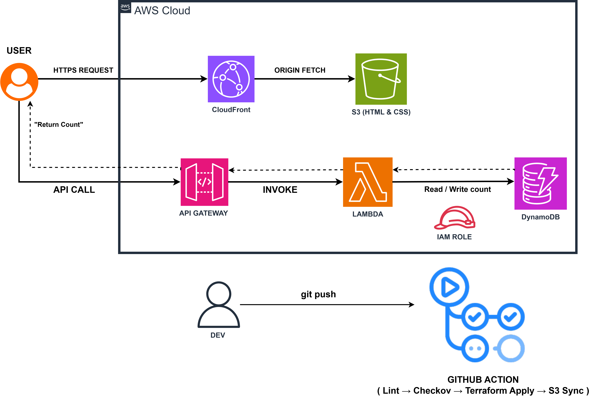

# Self-Deploying Portfolio 🚀

A serverless portfolio website on AWS — all infrastructure provisioned by **Terraform**, auto-deployed via **GitHub Actions**, security-scanned by **Checkov**, with a real-time **cost dashboard**.

**Live:** [https://df4afxcfwis2q.cloudfront.net](https://df4afxcfwis2q.cloudfront.net) · **Status:** [/status.html](https://df4afxcfwis2q.cloudfront.net/status.html)

---

## Architecture


**CI/CD Pipeline:** `git push` → Checkov Scan → Terraform Validate → S3 Sync → CloudFront Invalidation

---

## Features

| Feature | Description |
|---------|-------------|
| **Infrastructure as Code** | All AWS resources defined in Terraform — zero console clicks |
| **4-Stage CI/CD** | Automated security scan → validate → deploy → cache invalidation |
| **DevSecOps** | Checkov scans every push for misconfigurations (shift-left security) |
| **Serverless Backend** | Lambda + DynamoDB visitor counter — $0 at low traffic |
| **FinOps Dashboard** | Live AWS cost breakdown via Cost Explorer API |
| **Security Hardened** | S3 blocked, CloudFront OAC, HTTPS enforced, IAM least privilege |

---

## Tech Stack

| Layer | Technology |
|-------|------------|
| Frontend | HTML · CSS · JavaScript |
| CDN | CloudFront (HTTPS + OAC) |
| Storage | S3 (private, static hosting) |
| Backend | Lambda (Python 3.12) |
| Database | DynamoDB (pay-per-request) |
| API | API Gateway v2 (HTTP) |
| IaC | Terraform |
| CI/CD | GitHub Actions |
| Security | Checkov · IAM least privilege · OAC · HTTPS redirect |

---

## Project Structure

```
├── .github/workflows/
│   └── deploy.yml            # CI/CD pipeline
├── lambda/
│   ├── visitor_counter.py    # Visitor count function
│   └── cost_dashboard.py     # Cost Explorer function
├── terraform/
│   ├── main.tf               # Provider config
│   ├── variables.tf          # Input variables
│   ├── outputs.tf            # Output values
│   ├── s3.tf                 # S3 bucket + policy
│   ├── cloudfront.tf         # CDN + OAC
│   ├── dynamodb.tf           # Visitor counter table
│   ├── lambda.tf             # Lambda function
│   ├── cost_lambda.tf        # Cost dashboard Lambda
│   ├── apigateway.tf         # API routes
│   └── iam.tf                # Roles + policies
├── website/
│   ├── index.html            # Portfolio
│   ├── status.html           # Cost dashboard
│   └── style.css             # Styling
└── README.md
```

---

## Security

Checkov runs on every push. Findings are reviewed and documented:

| Finding | Decision | Why |
|---------|----------|-----|
| DynamoDB backup not enabled | Accepted | Non-critical visitor counter data |
| DynamoDB KMS CMK encryption | Accepted | Default encryption is sufficient |
| CloudFront geo restriction | Accepted | Portfolio is intentionally global |
| CloudFront access logging | Planned | Will add in future iteration |

---

## Cost

Runs within **AWS Free Tier**:

| Service | Free Tier | This Project |
|---------|-----------|-------------|
| S3 | 5 GB | < 1 MB |
| CloudFront | 1 TB/month | Minimal |
| Lambda | 1M requests/month | < 100 |
| DynamoDB | 25 GB | 1 item |
| API Gateway | 1M requests/month | < 100 |

---

## Deploy

**Automated:** Push to `master` → GitHub Actions does everything.

**Manual:**
```bash
cd terraform
terraform init && terraform apply

aws s3 sync website/ s3://cloud2026-portfolio-website --delete
aws cloudfront create-invalidation --distribution-id E2IOSMWUGMP3LF --paths "/*"
```

**Requires:** AWS CLI configured, Terraform >= 1.6.0, GitHub Secrets (`AWS_ACCESS_KEY_ID`, `AWS_SECRET_ACCESS_KEY`)

---

## What I Learned

- Terraform IaC — providers, variables, outputs, state, resource dependencies
- AWS serverless — S3 + CloudFront + Lambda + DynamoDB + API Gateway
- CI/CD pipelines — multi-stage GitHub Actions with conditional deployment
- DevSecOps — Checkov scanning, shift-left security, least privilege IAM
- FinOps — Cost Explorer API, cost-aware architecture design

---

## Author

**Jeian Jasper** · BS Information Technology · Quezon City University

[](https://github.com/jeianjaz) [](https://www.linkedin.com/in/jeianjasper/)